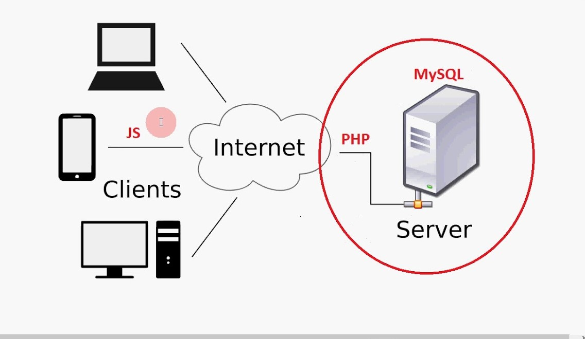
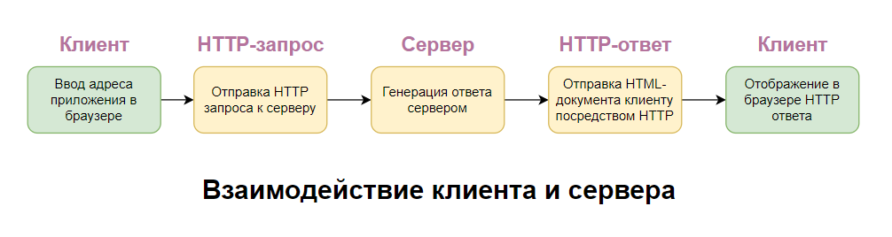
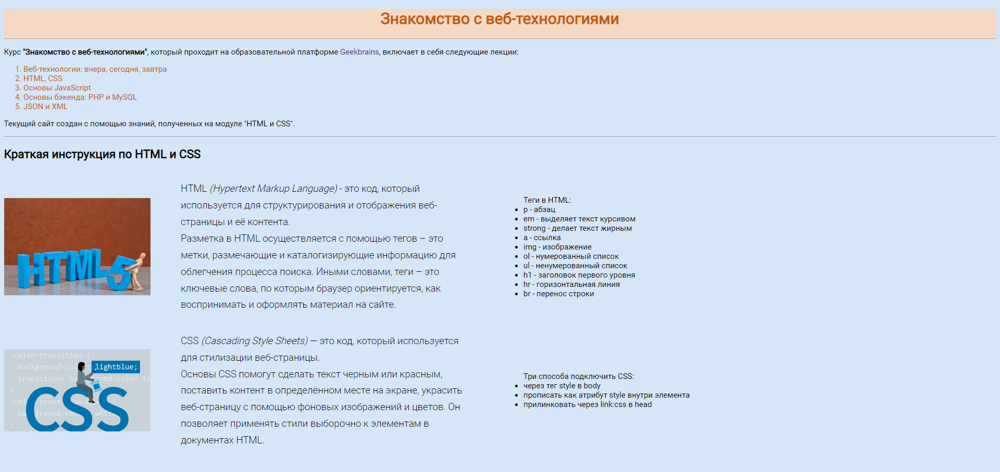
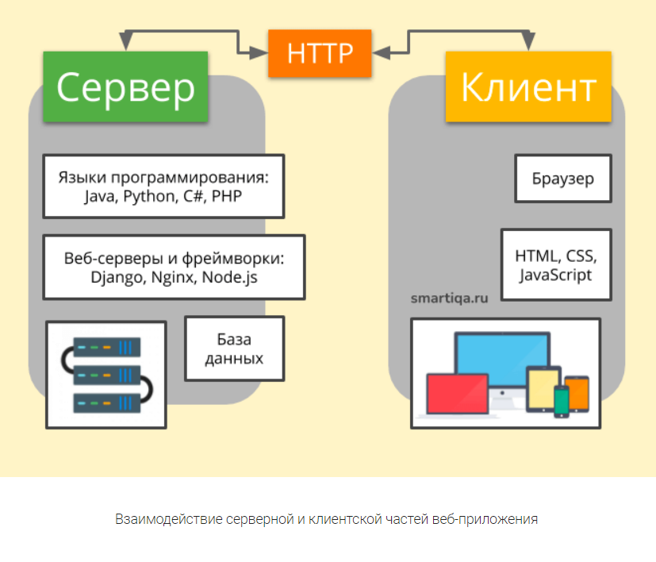

## Глава 1. Основы ручного тестирования веб-приложений

### 1.1 Что такое веб-приложение, его особенности

Поскольку в качестве объекта в данной работе мы рассматриваем процесс ручного тестирования веб-приложений, то стоит сперва разобраться, что подразумевается под понятием веб-приложение.  

Прежде, чем мы дадим определение веб-приложению, отметим, что для выполнения своих задач веб-приложению требуется доступ к сети Интернет. Следовательно, важно понимать специфику работы Интернета и способы передачи данных между устройствами. Давайте кратко познакомимся с некоторыми веб-технологиями, которые нам в дальнейшем пригодятся в работе. 

Как мы прекрасно знаем, на сегодняшний день к глобальной сети Интернет могут подключаться не только компьютеры, телефоны, планшеты, а также такие устройства, как холодильники, умные устройства, стиральные машины, кофемашины и прочие гаджеты, которые составляют новое направление в IT сфере - Интернет вещей.  

Поэтому можно сказать, что **Интернет** - это объединенные по всему миру в сеть компьютеры и иные схожие устройства, осуществляющие процессы обмена и хранения информации, благодаря которым люди могут общаться, обучаться, просматривать фильмы и слушать музыку, не учитывая границы и расстояния.

Все сайты хранятся на сервере - очень мощном компьютере, с которого передаются запросы на устройства пользователей (клиенты). Сервер работает постоянно: 24/7.  

**Клиент** — это веб-браузер (или иное программное обеспечение) и устройство, на котором он непосредственно установлен, передающие веб-серверу запросы на получение ресурсов, обозначенных URL-адресами. Клиентом может быть компьютер, ноутбук, телефон, планшет и т.п. 

Интернет-ресурсами являются HTML-страницы, файлы, изображения и иные данные, запрашиваемые клиентом. В ответ на такие запросы веб-сервер пересылает искомую информацию клиенту. Обмен запросами и ответами между клиентами и веб-серверами происходит посредствам протокола HTTP. 

#### HTTP как вакцина для сети

 По сути, глобальная сеть представляет собой передачу информации между локальными сетями. Информация по сети передается в виде текста. Представим себе, что у каждой локальной сети текст будет оформлен по-разному. Если правила оформления не совпадают, то компьютеры из разных сетей не смогут понимать друг друга и обмениваться информацией.  

Чтобы компьютеры могли общаться между собой на одном языке и без проблем открывали передаваемые файлы, были созданы общие для всех наборы правил - протоколы.   

Самый популярный на данный момент протокол - HTTP (Hyper Text Transfer Protocol). 

Основная задача HTTP - обмен данными между клиентом и сервером.   

Важно знать, что HTTP не предполагает использование шифрования для передачи информации. По сути, передается текст, который может прочитать кто угодно. Чтобы решить эту проблему, используется HTTPs.  

**HTTPs** (s – secure, безопасность) — это распространённое расширение для протокола HTTP, которое реализует упаковку передаваемых данных в криптографический протокол. Благодаря этому расширению обеспечивается защита данных от атак и перехвата.   

Еще одна проблема Интернета, с которой когда-то столкнулись пользователи сети: чем больше становится ресурсов, тем сложнее их найти и однозначно определить, так как можно попасть на другой похожий ресурс. Для решения этого вопроса был создан URL– Uniform resourse locator - унифицированный определитель местонахождения ресурса. Сейчас он часто используется как синоним веб-адреса (простыми словами - это привычная нам ссылка). Самый простой URL состоит из протокола, доменного имени и указателя на страницу на сайте. Полностью выглядит так: <https://rivegauche.ru/promotionslist> .

#### Но как же создаются сайты?

 Основной технологией создания сайтов является **HTML** (Hypertext Markup Language) - язык гипертекстовой разметки. Языков гипертекстовой разметки существует множество и все они созданы, чтобы устранить очевидные отличия человека от машины. Наш мозг лучше воспринимает сгруппированную (отформатированную на заголовки, подзаголовки, основной текст) информацию, а не сплошной текст, как в случае с компьютером. С появлением языка гипертекстовой разметки HTML-файлы стали структурированными (появились заголовки, таблицы, картинки и т.п.), но такие файлы надо открывать в специальных программах (браузерах), которые могут их преобразовать в нужный вид. 

Чтобы браузер понял, как отображать текст, используются теги. **HTML тег** — это специальный код (метка, команда), который указывает браузеру, как интерпретировать документ для пользователя.  

Иными словами теги – это ключевые слова, по которым браузер ориентируется, как воспринимать и оформлять материал на сайте.  

HTML придает структуру тексту, форматирует контент. Но HTML-станицы обладают статичной формой подобно странице книги, газеты или журнала, в них нет динамики, а также средства языка HTML в плане дизайна довольно ограничены. Поэтому для создания сайтов используются дополнительные технологии.  

#### CSS

Благодаря каскадным таблицам стилей CSS произошло разделение наполнения HTML-страницы на представление и контент. Оформление всех элементов в CSS можно задавать, выбирая эти элементы из общего контента с помощью селекторов. Селектор определяет, к какому элементу применять то или иное CSS-правило. Можно изменить фон определенного блока, шрифт элемента, цвет заголовка. То есть с помощью селекторов осуществляется придание HTML-странице “красоты”.

Но как страницу сделать «живой» – чтобы на ней были интерактивные элементы – реагирующие на наши касания и сохраняющие введенные нами данные (например, имя и пароли)? Для этой цели был создан язык программирования **JavaScript** - легковесный скриптовый язык программирования, код которого можно писать прямо в тексте веб-страниц. Например, по наведению мыши на ссылку или картинку благодаря JavaScript можно показывать всплывающую подсказку. 

#### PHP 

**PHP** (Hypertext Preprocessor) – препроцессор гипертекста, серверный язык программирования. PHP специально сконструирован для веб-разработок и его код может внедряться непосредственно в HTML.  

PHP позволил соединить HTML и синтаксически близкий к C язык программирования. PHP привносит в HTML-страницу динамику. Практически все сайты, который есть в интернете, работают на PHP: социальные сети; блоги и форумы; интернет-магазины; браузерные игры и др. 

Мы узнали, как создаются веб-документы и каким образом они появляются в браузере, а также разобрались за счет каких инструментов мы можем «оживить» страницы и даже сохранить на компьютере пароль, чтобы не вводить его каждый раз.  

Теперь рассмотрим **структуру современного сайта**: 

* Хедер — это верхняя часть, шапка веб-страницы (Заголовок, Навигационное меню)   

* Основное содержимое (контент) 

* Сайдбар (англ. sidebar) – это боковая колонка сайта или блога, в которой размещена вспомогательная информация для посетителей. Обычно располагается в правой части окна. 

* Футер - полоса в нижней части страницы, которая обычно содержит уведомления об авторских правах, контактную информацию. 

Стоит отметить, что у каждой HTML-страницы есть блоки (например: хедер, футер), в которых информация от запроса к запросу остается неизменной, а меняется только основной контент. Что, если в запросах передавать только изменяемую часть? Тогда скорость ответа от сервера увеличится, времени на ответ будет затрачено меньше, а также мы значительно сэкономим память. Для реализации этой идеи были созданы веб-приложения: страницы хранятся не в собранном виде, а собираются на сервере как пазл из отдельных блоков в момент формирования сервером ответа на запрос от клиента. Вместо статических страниц у нас теперь страница формируется после запроса. Кроме того, можно часть действий выполнять без обращения к серверу.  

На сегодняшний день можно выделить 3 типа приложений: десктопные, мобильные, web. 

*Десктопные приложения* предполагают установку клиента на стороне пользователя. В зависимости от типа операционной системы, процессора, видеокарты и других параметров могут потребоваться разные версии программы. Это создает определенные неудобства как разработчикам (им требуется постоянно выискивать баги в разных средах, расширять объем кода для учета всех возможных комбинаций железа клиента), так и пользователям (необходимо скачивание постоянных обновлений, новое железо с той операционной системой, которую поддерживает приложение). 
 
*Мобильные приложения* разрабатываются специально для смартфонов и планшетов с учетом установленной там операционной системы (Android, iOS и др.). 
 
Наиболее динамично на сегодня развиваются *веб-приложения*, так как они для своей работы требуют только установленный браузер на клиентской стороне. Они: 

* Могут работать как на смартфоне, так и персональном компьютере; 

* Практически независимы от железа; 

* По функционалу скоро перестанут уступать десктопным аналогам. 

#### Веб-приложения 

**Веб-приложение** – программа с определенным набором функционала, использующая в качестве клиента браузер. Другими словами, если приложению для осуществления бизнес-логики требуется сетевое соединение (Интернет) и наличие на стороне пользователя браузера, то его относят к веб-приложению.

Веб-приложения имеют блочный тип, чтобы не хранить всю страницу в собранном виде, а под каждый запрос формировать страницу на сервере. Т.е. в веб-приложении обновляется только форма выдачи, а навигация, шапка, баннеры остаются без изменений - это экономия памяти, оптимизация работы.  

Веб-приложения можно разделить на несколько типов, в зависимости от разных сочетаний его основных составляющих:  

1. *Backend* (бэкенд или серверная часть приложения) работает на удаленном компьютере, который может находиться где угодно. Она может быть написана на разных языках программирования (самые популярные: Python, Java, Ruby, PHP, C# и др.). Если создавать приложение используя только серверную часть, то в результате любых переходов между разделами, отправок форм, обновления данных, сервером будет генерироваться новый HTML-файл, и страница в браузере будет перезагружаться.  

Они практически не требуют пользовательского вмешательства.  
Пример чисто серверного приложения – push-уведомления (от почтовых сервисов, мессенджеров, операторов связи) в смартфонах. Клиент получает информацию, что появилось новое сообщение, письмо, изменения в тарифе, не предпринимая для этого никаких действий. 
 
2. *Frontend* (фронтенд или клиентская часть приложения) выполняется в браузере пользователя. Эта часть написана на языке программирования Javascript. Приложение может состоять только из клиентской части, если не требуется хранить данные пользователя дольше одной сессии. Типичные примеры таких приложений: простые игры, браузерный фоторедактор. 
 
3. *Single page application* (SPA или одностраничное приложение). Вариант, когда используются и бэкенд, и фронтенд. С помощью их взаимодействия можно создать приложение, которое будет работать практически без перезагрузок страницы в браузере. Динамическое обновление содержимого страницы достигается технологией **AJAX** (Asynchronous JavaScript and XML, асинхронный JavaScript и XML). В ответ на действия пользователя (прокрутка страницы, нажатие кнопок, заполнение формы, движение ползунка и т.п.) содержание страницы будет меняться почти моментально. 
 
В сочетании с фреймворками **JavaScript (Angular, React, Vue)** работа таких программ становится максимально плавной. 
 
Практически все почтовые сервисы являются SPA.

#### «Фронтенд» и «бэкенд» 

* **Фронтенд** (от англ. frontend) — интерфейс, представление на экране пользователя. Все, что браузер может читать, выводить на экран и/или запускать. То есть это HTML, CSS и JavaScript. 

* **Бэкенд** (от англ. backend) — все, что работает на сервере, то есть «не в браузере» (обработка запросов, запись в базы данных получаемых сведений) 

Для бэкенда можно использовать любой язык программирования, а также использовать СУБД.  

Существует несколько основных архитектур, определяющих, как будут взаимодействовать бэкенд и фронтенд в веб-приложении: 

* *Серверные приложения.* В этом случае HTTP-запросы отправляются напрямую на сервер приложения, а сервер отвечает HTML-страницей. Между получением запроса и ответом сервер обычно ищет по запросу информацию в базе данных и встраивает ее в шаблон. Когда страница загружена в браузере, HTML определяет, что будет показано, CSS — как это будет выглядеть, а JS отвечает за интерактивность.  

* *Связь с использованием AJAX.* Другой тип архитектуры использует для связи **AJAX** (Asynchronous JavaScript and XML). Это означает, что JavaScript, загруженный в браузере, отправляет HTTP-запрос (XHR, XML HTTP Request) изнутри страницы и получает **XML-ответ** (текстовый файл с расширением xml, написанный на языке программирования для создания логической структуры данных, их хранения и передачи в виде, удобном и для компьютера, и для человека). Сейчас для ответов также можно использовать формат **JSON** (более компактный и удобный вариант, по сравнению с XML). Это значит, что у сервера должна быть конечная точка, которая отвечает на запросы JSON- или XML-кодом. Два примера протоколов, используемых для этого — **REST** и **SOAP**.  

* *Клиентские (одностраничные) приложения.* Технология AJAX позволяет загружать данные без обновления страницы. Больше всего это используется в таких фреймворках, как Angular и Ember. После сборки такие приложения отправляются в браузер, и любой последующий рендеринг (отрисовка) выполняется на стороне клиента (в браузере). Такой фронтенд общается с бэкендом через HTTP-протокол, используя JSON- или XML-ответы.  

* *Универсальные/изоморфные приложения.* Некоторые библиотеки и фреймворки, например, React и Ember, позволяют исполнять приложения, как на сервере, так и в клиенте (на компьютере пользователя). В этом случае для связи фронтенда с бэкендом приложение использует и AJAX, и обрабатываемый на сервере HTML.  

Прогрессивные веб-приложения загружаются лишь один раз и работают (почти) всегда. Можно хранить базу данных в браузере. В некоторых случаях веб-приложениям нужен бэкенд только при первой загрузке, а затем лишь для синхронизации/защиты данных. Такой уровень постоянства означает, что большая часть логики приложения находится непосредственно на клиенте. 

#### Фреймворки 

Все веб-приложения обладают схожим функционалом. Например, в интернет-магазине: авторизация, личный кабинет, корзина, карточка товара, форма оплаты. Фреймворки позволяют вместо написания функционала с нуля выставить настройки из имеющихся вариантов и быстро получить готовый продукт.  

**Фреймворки** - это шаблоны для быстрого создания веб-приложений, с их помощью можно значительно ускорить процесс разработки. Также фреймворки дают возможность подключаться к различным типам СУБД без погружения в специфику инфраструктуры, создавать элементы интерфейса и ускорять процесс верстки. В них есть готовые решения для работы с файловой системой, инструменты для оптимизации и ускорения работы приложения. 
 
## Краткое подведение итогов:  

Благодаря HTML (языку гипертекстовой разметки), CSS (каскадным таблицам стилей), Javascript (для оживления статики страниц), серверным технологиям (Apache, Nginx, AJAX), языкам программирования (Python, Java, PHP и др.) и различным фреймворкам стало возможным делать крупные массовые веб -приложения, обладающие большим функционалом. Технологии создания веб-приложений продолжают активно развиваться. Вот почему тестирование веб-приложений весьма популярно в наши дни и открывает широкие перспективы развития для начинающих тестировщиков.

Источники:  
1. <https://smartiqa.ru/courses/web/lesson-1?ysclid=l8ad26rhlr917121739#theory>
2. <https://habr.com/ru/post/450282/?ysclid=l8k8gdlt3z992425699>