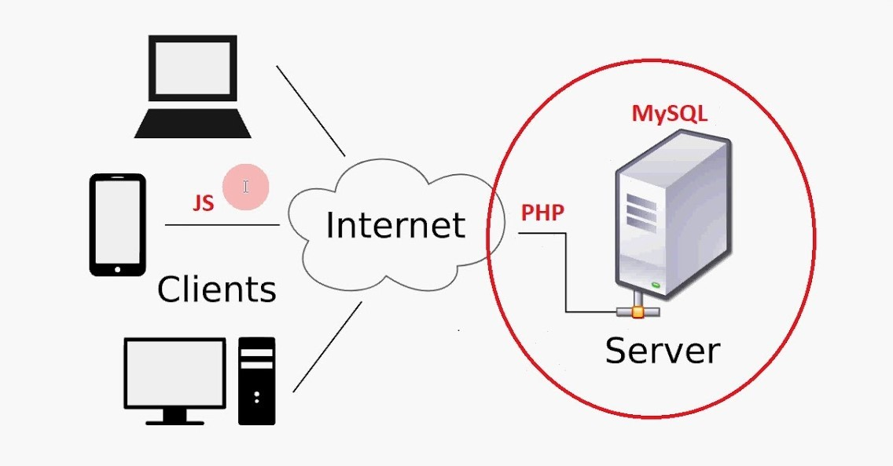

## Глава 1. Основы ручного тестирования веб-приложений

### 1.1 Что такое веб-приложение, его особенности

Поскольку в качестве объекта в данной работе мы рассматриваем процесс ручного тестирования веб-приложений, то стоит сперва разобраться, что подразумевается под понятием веб-приложение.  

Прежде, чем мы дадим определение веб-приложению, отметим, что для выполнения своих задач веб-приложению требуется доступ к сети Интернет. Следовательно, важно понимать специфику работы Интернета и способы передачи данных между устройствами. Давайте кратко познакомимся с некоторыми веб-технологиями, которые нам в дальнейшем пригодятся в работе. 

Как мы прекрасно знаем, на сегодняшний день к глобальной сети Интернет могут подключаться не только компьютеры, телефоны, планшеты, а также такие устройства, как холодильники, умные устройства, стиральные машины, кофемашины и прочие гаджеты, которые составляют новое направление в IT сфере - Интернет вещей.  

Поэтому можно сказать, что **Интернет** - это объединенные по всему миру в сеть компьютеры и иные схожие устройства, осуществляющие процессы обмена и хранения информации, благодаря которым люди могут общаться, обучаться, просматривать фильмы и слушать музыку, не учитывая границы и расстояния.

