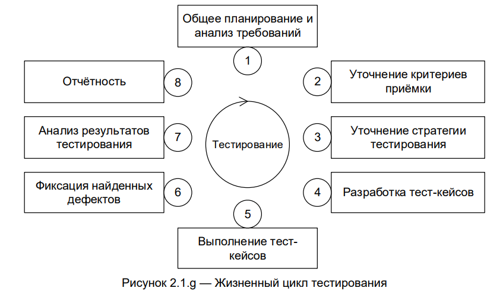

# 1.4 Этапы ручного тестирования веб-приложений 

## Основные стадии тестирования 

В каждой компании этапы процесса тестирования могут называться по-разному. Однако суть и общее представление об этапах тестирования будут оставаться неизменными.  

Роман Савин предлагает [1], чтобы мы, изучая цикл тестирования, абстрагировались от цикла разработки. Что нам это даст? Гибкость, так как, зная цикл тестирования как независимый процесс, мы сможем легко связать его с любым циклом разработки ПО в любой интернет-компании.  

Савин выделяет три основные стадии цикла тестирования ПО: 

1. Подготовка к тестированию: изучение и анализ предмета тестирования; 

2. Подготовка к тестированию: планирование тестирования;  

3. Исполнение тестирования.

Целью этапа _“Изучение и анализ предмета тестирования”_ является получение ответов на два вопроса:  

а. **Какие функциональности** предстоит протестировать?  

б. **Как** эти функциональности **работают**? 

На этапе _“Планирование тестирования”_ мы ищем ответ на один простой вопрос: **"Как будем тестировать?"**. На этом этапе создается тестовая документация (чек-листы/тест-кейсы). 

Причем, как отмечает Савин, качество продукта (а значит, и счастье пользователей) напрямую зависит _от мудрости найденных решений_. Мудрость найденных решений проявляется в двух вещах:  

а) кратких, простых и изящных путях для проверки функциональностей;  

б) компромиссе между объемом тестирования, который возможен в теории; объемом тестирования, который возможен на практике[2].

Суть “Исполнения тестирования” — это практический поиск багов в написанном коде с использованием тест-кейсов, созданных ранее.  

Мы исполняем тест-кейсы, рассчитывая найти баги. После нахождения бага тестировщик заносит запись о нем в систему трэкинга багов; после того, как программист починил баг, тестировщик проверяет:  

а) действительно ли баг был **починен**. Проверка осуществляется путем исполнения шагов, которые ранее привели к багу, или, в профессиональной терминологии, путем генерации ввода, который привел к выводу, несоответствующему ожидаемому результату;  

б) не появились ли **новые баги** как нечаянное следствие изменения кода при починке.  

Проверка осуществляется путем тестирования функциональностей, работа которых могла быть затронута починкой. Тестирование, последдовательно исполняемое в пунктах а) и б), также называется **регрессивным тестированием** (regression testing). 

Таким образом исполнение тестирования идет в два этапа:  

• **тестирование новых функциональностей**; 

• **регрессивное тестирование**. 

## Этапы жизненного цикла тестировани

Рассмотрим другой вариант представления этапов процесса тестирования ПО, который в большей степени соотносится с основными этапами разработки программного продукта.

1. Работа с требованиями 

2. Разработка стратегии тестирования и планирование процедур контроля качества 

3. Создание тестовой документации 

4. Тестирование прототипа 

5. Основное тестирование 

6. Стабилизация 

7. Эксплуатация и поддержка 

**Работа с требованиями**. Знакомство с требованиями заказчика, что должен из себя представлять итоговый продукт, обсуждение. 

**Разработка стратегии тестирования**. Оценка сроков тестирования, выявление среды тестирования, объединение всей информации, полученной при работе с требованиями. 

**Создание тестовой документации**. Написание сценариев, которые позволят проверить функционал. 

**Тестирование прототипа**. Тестирование основного функционала продукта, корректировка целей, добавление фичей. 

**Основное тестирование**. Выполнение общей проверки продукта. 

**Стабилизация**. На данном этапе происходит работа над устранением багов. 

**Эксплуатация и поддержка**. Проводится регрессионное тестирование, устранение ошибок, которые нашел конечный пользователь. 

Прежде, чем переходить к описанию каждого этапа тестирования, необходимо запомнить важное правило: переход к следующему этапу допустим лишь после полного завершения работы на предыдущем. Теперь поговорим о каждом этапе тестирования отдельно. 

### Этап 1. Работа с требованиями 

Команда тестирования знакомится с требованиями заказчика, функционалом продукта. На данном этапе важно непрерывное общение команд, необходимо задавать вопросы разработчикам и заказчику.  

* что нам предстоит тестировать;  

* как много будет работы;  

* какие есть сложности;  

* всё ли необходимое у нас есть и т.п.  

Как правило, получить ответы на эти вопросы невозможно без анализа требований, т.к. именно требования являются первичным источником ответов. 

Тщательное изучение требований должно: 

* выявить противоречия в требованиях; 

* помочь определить потенциальные дефекты в функционале. 

### Этап 2. Разработка стратегии тестирования и планирование процедур контроля качества 

Данный этап важен для лидов или менеджеров, поскольку от понимания полученной на предыдущем этапе информации зависит качество тестирования.  

Тест-лид должен:  

* резюмировать полученную информацию,  

* оценить сроки тестирования,  

* разработать стратегию тестирования: определить виды тестирования, которые можно применить к проекту, проанализировать имеющиеся среды и ресурсы, что имеется для проведения тестирования, описать приоритеты для непредвиденных ситуаций, как и где будет вестись тестовая документация;  

* определение среды тестирования: какое оборудование необходимо для тестирования, 

* составить план, который содержит описание, с чего начинается и чем заканчивается тестирование, и что будет тестироваться. 

Уточнение критериев приёмки позволяет сформулировать метрики и признаки начала тестирования (entry criteria), приостановки (suspension criteria) и возобновления (resump criteria) тестирования, завершения или прекращения тестирования (exit criteria). 

Уточнение стратегии тестирования представляет собой ещё одно обращение к планированию, но уже на локальном уровне: рассматриваются и уточняются те части стратегии тестирования (test strategy), которые актуальны для текущей итерации. 

### Этап 3. Создание тестовой документации 

Цель данного этапа – создать документацию, объем которой будет охватывать детализацию, ход работ, а также вносить ясность для заказчика. 

Общение с другими командами, понимание желаний заказчика напрямую влияют на качество тестовой документации. После проведенного тестирования можно проанализировать его успешность. 

Тестовая документация может состоять из: 

* тест-кейсов, наборов тест-кейсов и иных артефактов, которые будут использоваться при непосредственном выполнении тестирования. 

* тестовых сценариев: что и как будет проверяться при регрессивном, дымовом и приемочном тестированиях; 

* отчетности: результаты тестирования, списка багов и их серьезность; 

Детализация тестовой документации зависит от проекта, поэтому она может отличаться и по охвату, и по формату, и по объему. Для тестировщика важно поддерживать документацию в актуальном виде, вносить любые изменения, связанные с изменением итогового продукта. 

### Этап 4.  Тестирование прототипа 

На этом этапе происходит выполнение тест-кейсов и фиксация найденных дефектов.  

При создании и тестировании прототипа продукта необходимо выявить основные отклонения от ожидаемого результата и соответствие с бизнес-стратегией. Здесь же выявляются ошибки в работе логики основного функционала, устраняются найденные уязвимости и дефекты, допущенные на этапе разработки. Заказчик может сам участвовать в процессе тестирования прототипа, чтобы он мог оценить, на каком этапе находится разработка продукта. После тестирования выдвигаются пожелания со стороны заказчика. Новые пожелания необходимо задокументировать, оценить сроки, внедрить в проект и передать на осмотр заказчику. 

Самый подходящий метод тестирования прототипа – проведение закрытого бета-тестирования, когда продукт тестирует продукт малое количество людей, которые в итоге будут использовать его после релиза. Это помогает учесть пожелания конечных пользователей. 

Очень важно лиду или менеджеру проекта передавать информацию тестировщикам и разработчикам о пожеланиях заказчика, на какие частые сбои в продукте натыкались пользователи для того, чтобы сделать его более понятным. 

### Этап 5. Основное тестирование 

Тестирование программного обеспечения является самым длительным и объемным процессом. Здесь формируются репорты о найденных дефектах, выполняется набор тестовых сценариев, создается тестовая среда, выполняется тестирование, виды которого были задокументированы на этапе создания тестовой документации. Смоук- и регресс-тестирования являются одними из основных видов тестирования, которые проводятся на данном этапе. 

Важно понимать: невозможно найти все ошибки в продукте. Но и не найти ошибки при тестировании можно считать провалом. Главная цель — не сделать идеальный продукт без ошибок, а найти максимальное количество дефектов, которые потенциально могут сломать систему. 

### Этап 6. Стабилизация 

Наверное, самый непонятный с точки зрения формулировки этап. На нем заканчивается работа с пожеланиями заказчика и фиксируются найденные баги. Он является связующим звеном между командой тестирования и командой разработчиков. На протяжении создания онлайн-ресурса команда разработчиков занималась своими делами, реализуя «хотелки» заказчика, а тестировщики репортили о новых дефектах. А на этапе стабилизации разработчики начинают слушать тестировщиков, устраняя то, что уже работает, но некорректно. 

Если продукт существует в какой-то большой системе, то на данном этапе также проверяется коммуникация системы и продукта, то есть проводится интеграционное тестирование. 

### Этап 7. Эксплуатация и поддержка 

После устранения дефектов команда разработчиков переходит в этап тестирования продукта в продакшн-среде. Так как многие ставят точку на проекте после релиза, очень важно подметить, что здесь происходит не только релиз продукта, но и пост-релизная поддержка.  

При всем желании нельзя учесть все нюансы использования, воссоздать ту среду, в которой будет использован продукт. Поэтому на данном этапе необходимо сделать акцент на том, что говорят пользователи, важно прислушиваться к их мнению, поскольку они участвуют не только в использовании продукта, но и тестировании, натыкаясь на ненайденные ошибки. Продукт становится частью жизнедеятельности людей, поэтому устранение дефектов и их поиск должен проводиться быстро и тщательно. Не всегда конечный пользователь может предоставить информацию о том, что он сделал для получения ошибки, поэтому за повторение дефекта берется QA-команда. 

На данном этапе происходит анализ результатов тестирования и создается отчётная документация. Формулируемые на стадии анализа результатов выводы напрямую зависят от плана тестирования, критериев приёмки и уточнённой стратегии, полученных на этапах 1 и 2. Полученные выводы оформляются на 7 этапе и служат основой для этапов 1 и 2 в следующей итерации тестирования. Таким образом, цикл тестирования ПО замыкается.  

Изучив все этапы тестирования сложно выделить главный – каждый из них важен по-своему. Тестирование является долгим и кропотливым процессом, результатом которого является выявленная ошибка в системе. Тестировщик должен четко формулировать свою позицию, почему найденная ошибки — действительно дефект, должен прислушиваться после релиза к позиции конечного пользователя и помнить, что ничто в этом мире не идеально. 

Как было отмечено ранее, названия этапов в разных проектах могут отличаться. Например, у Куликова [3] жизненный цикл тестирования ПО выглядит следующим образом:  

 

1. Общее планирование и анализ требований
2. Уточнение критериев приемки
3. Уточнение стратегии тестирования 
4. Разработка тест-кейсов
5. Выполнение тест-кейсов
6. Фиксация найденных дефектов
7. Анализ результатов тестирования
8. Отчетность

Названия этапов несколько отличаются от тех, что мы рассматривали выше. Однако суть остается прежней: дело в том, что мы рассмотрели тестирование в совокупности с этапами процесса разработки ПО, чтобы лучше понять роль и место тестирования в общем процессе разработки программного продукта.  

## Краткое подведение итогов:  

Процесс тестирования условно можно разделить на три стадии:  

1. Подготовка к тестированию: Изучение и анализ предмета тестирования. 

2. Подготовка к тестированию: Планирование тестирования.  

3. Исполнение тестирования: тестирование новых функциональностей, регрессионное тестирование. 

Основные этапы тестирования:  

1. Работа с требованиями 

2. Разработка стратегии тестирования и планирование процедур контроля качества 

3. Создание тестовой документации 

4. Тестирование прототипа 

5. Основное тестирование 

6. Стабилизация (исправление найденных дефектов) 

7. Эксплуатация и поддержка

Источники: 

https://qualitica.ru/blog/etapy-testirovaniya-po/

[1] Р. Савин. Тестирование Дот Ком, или Пособие по жестокому обращению с багами в интернет-стартапах. — М.: Дело, 2007. - C. 131.

[2] Р. Савин. Тестирование Дот Ком, или Пособие по жестокому обращению с багами в интернет-стартапах. — М.: Дело, 2007. - C. 135-136.
[3] С. Куликов. Тестирование программного обеспечения. Базовый курс. 3-е издание. Версия книги 3.0.11 от 16.07.2021. - C. 27. 