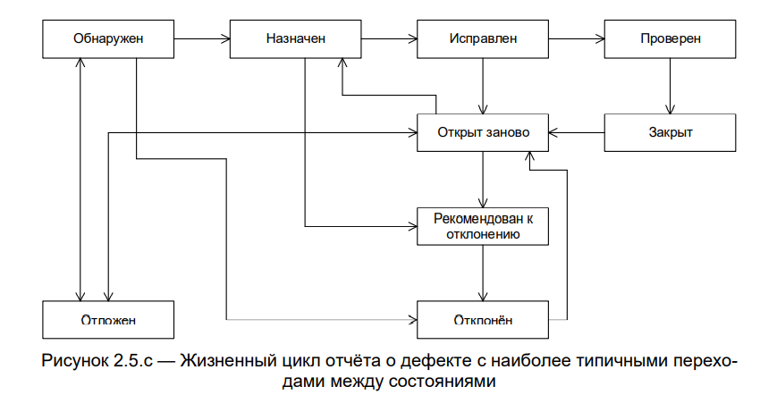

# 2.5 Баг-репорты и багтрекинговая система. Отчет о тестировании  

В ходе тестирования важно помнить о том, что качественное ПО обладает двумя характеристиками:  

1. Соответствует требованиям;  

2. Удовлетворяет потребность пользователя. 

**Дефект** (баг) — это отклонение фактического результата от ожидаемого. 

**Отчёт о дефекте** (bug report) — документ, который содержит отчет о любом недостатке в компоненте или системе, который потенциально может привести компонент или систему к невозможности выполнить требуемую функцию. Отчет о дефекте описывает шаги воспроизведения дефекта, фактический и ожидаемый результат, серьезность дефекта и приоритет его устранения.  

Часто на проектах понятия “Отчет о дефекте”, “баг-репорт” и “баг” равнозначны (являются синонимами).  

На что опираемся при заведении дефекта: 

1. Требования  

2. Спецификации  

3. Технические задания  

4. На предыдущий опыт  

5. На критерии качества  

6. На логику и здравый смысл 

### Причины появления дефектов: 

1. Проблемы в коммуникациях между членами команды  

2. Сложность программного обеспечения  

3. Изменение требований  

4. Ошибки программистов  

5. Ошибки тестировщиков 

## Жизненный цикл дефекта 

Самое классическое представление: 

Open – In Progress – Ready for test – Testing – Close.  

Открыт - В работе - Ожидает проверки - В процессе проверки - Закрыт. 

Отчёт о дефекте (и сам дефект вместе с ним) проходит определённые стадии жизненного цикла, которые схематично можно показать так[1]: 

  

* **Обнаружен** (submitted) — начальное состояние отчёта (иногда называется «Новый» (new)), в котором он находится сразу после создания. Некоторые средства также позволяют сначала создавать черновик (draft) и лишь потом публиковать отчёт.  

* **Назначен** (assigned) — в это состояние отчёт переходит с момента, когда кто-то из проектной команды назначается ответственным за исправление дефекта.  

* **Исправлен** (fixed) — в это состояние отчёт переводит ответственный за исправление дефекта член команды после выполнения соответствующих действий по исправлению. 

* **Проверен** (verified) — в это состояние отчёт переводит тестировщик, удостоверившийся, что дефект на самом деле был устранён. Как правило, такую проверку выполняет тестировщик, изначально написавший отчёт о дефекте. 

* **Закрыт** (closed) — состояние отчёта, означающее, что по данному дефекту не планируется никаких дальнейших действий. Здесь есть некоторые расхождения в жизненном цикле, принятом в разных инструментальных средствах управления отчётами о дефектах: в некоторых средствах существуют два состояния — *«Проверен»* и *«Закрыт»*, чтобы подчеркнуть, что в состоянии «Проверен» ещё могут потребоваться какие-то дополнительные действия (обсуждения, дополнительные проверки в новых билдах и т.д.), в то время как состояние «Закрыт» означает «с дефектом покончено, больше к этому вопросу не возвращаемся». В некоторых средствах в состояние *«Закрыт»* или *«Отклонён»* отчёт о дефекте может быть переведён из множества предшествующих состояний с резолюциями наподобие:  

    * **«Не является дефектом»** — приложение так и должно работать, описанное поведение не является аномальным.  

    * **«Дубликат»** — данный дефект уже описан в другом отчёте.  

    * **«Не удалось воспроизвести»** — разработчикам не удалось воспроизвести проблему на своём оборудовании.  

    * **«Не будет исправлено»** — дефект есть, но по каким-то серьёзным причинам его решено не исправлять.  

    * **«Невозможно исправить»** — непреодолимая причина дефекта находится вне области полномочий команды разработчиков, например существует проблема в операционной системе или аппаратном обеспечении, влияние которой устранить разумными способами невозможно.

* **Открыт заново** (reopened) — в это состояние (как правило, из состояния «Исправлен») отчёт переводит тестировщик, удостоверившийся, что дефект по-прежнему воспроизводится на билде, в котором он уже должен быть исправлен.  

* **Рекомендован к отклонению** (to be declined) — в это состояние отчёт о дефекте может быть переведён из множества других состояний с целью вынести на рассмотрение вопрос об отклонении отчёта по той или иной причине. Если рекомендация является обоснованной, отчёт переводится в состояние «Отклонён» (см. следующий пункт).  

* **Отклонён** (declined) — в это состояние отчёт переводится в случаях, подробно описанных в пункте «Закрыт», если средство управления отчётами о дефектах предполагает использование этого состояния вместо состояния «Закрыт» для тех или иных резолюций по отчёту.  

* **Отложен** (deferred) — в это состояние отчёт переводится в случае, если исправление дефекта в ближайшее время является нерациональным или не представляется возможным, однако есть основания полагать, что в обозримом будущем ситуация исправится (выйдет новая версия библиотеки, вернётся из отпуска специалист по некоей технологии, изменятся требования заказчика и т.д.). 

Набор стадий жизненного цикла, их наименование и принцип перехода от стадии к стадии может различаться в разных инструментальных средствах управления жизненным циклом отчёта о дефекте (баг-трекинговых системах). 

## Атрибуты отчета о дефекте: 

1. **Уникальный идентификатор** (ID) — присваивается автоматически системой при создании баг-репорта. 

2. **Тема** (краткое описание, Summary) — кратко сформулированный смысл дефекта, отвечающий на вопросы: Что? Где? Когда (при каких условиях)? 

3. **Подробное описание** (Description) — более широкое описание дефекта (указывается опционально). 

4. **Шаги для воспроизведения** (Steps To Reproduce) — описание четкой последовательности действий, которая привела к выявлению дефекта. В шагах воспроизведения должен быть описан каждый шаг, вплоть до конкретных вводимых значений, если они играют роль в воспроизведении дефекта. 
 
5. **Фактический результат** (Actual result) — описывается поведение системы на момент обнаружения дефекта в ней. чаще всего, содержит краткое описание некорректного поведения(может совпадать с темой отчета о дефекте). 

6. **Ожидаемый результат** (Expected result) — описание того, как именно должна работать система в соответствии с документацией. 
 

7. **Вложения** (Attachments) — скриншоты, видео или лог-файлы. 

8. **Серьёзность дефекта** (важность, Severity) — характеризует влияние дефекта на работоспособность приложения. 

9. **Приоритет дефекта** (срочность, Priority) — указывает на очерёдность выполнения задачи или устранения дефекта. 

10. **Статус** (Status) — определяет текущее состояние дефекта. Статусы дефектов могут быть разными в разных баг-трекинговых системах. 

11. **Окружение** (Environment) – окружение, на котором воспроизвелся баг. 

## Правила хорошего баг-репорта  

1. Для составления названия баг-репорта используется правило «Что? Где? Когда?», до 10 слов (т.е. название отвечает на вопросы “Что происходит?”, “Где происходит?”, “При каких условиях?”). 

2. Воспроизводить дефект, следуя собственным шагам.  

3. Есть фактический и ожидаемый результат: один баг — одна пара ОР и ФР  

4. Одна ошибка—один отчет о дефекте.  

5. Краткость—сестра баг-репорта.  

6. Писать техническим языком.  

7. Прикреплять дополнительные файлы: логи, скриншоты, видео.  

8. Прикреплять ссылки к требованиям. 

9. Избегать дубликатов дефектов.  

10. Указывать окружение, на котором обнаружился дефект.  

## Severity vs Priority 

**Серьёзность** (severity) показывает степень ущерба, который наносится проекту существованием дефекта. Severity выставляется тестировщиком. 
 
### Градация Серьезности дефекта (Severity): 

* **Блокирующий** (S1 – Blocker) — функция не работает. 

    Тестирование значительной части функциональности вообще недоступно. 		Блокирующая ошибка, приводящая приложение в нерабочее состояние, в 		результате которого дальнейшая работа с тестируемой системой или ее 	к	лючевыми функциями становится невозможна. 

* **Критический** (S2 – Critical) —функция работает, но с ограничениями. 
    Критическая ошибка, неправильно работающая ключевая бизнес-логика, дыра в системе безопасности, проблема, приведшая к временному падению сервера или приводящая в нерабочее состояние некоторую часть системы, то есть не работает важная часть одной какой-либо функции либо не работает значительная часть, но имеется workaround (обходной путь/другие входные точки), позволяющий продолжить тестирование. 

* **Значительный** (S3 – Major) —функция работает, но неправильно. 
    Не работает важная часть одной какой-либо функции/бизнес-логики, но при выполнении специфических условий, либо есть workaround, позволяющий продолжить ее тестирование либо не работает не очень значительная часть какой-либо функции. Также относится к дефектам с высокими visibility – обычно не сильно влияющие на функциональность дефекты дизайна, которые, однако, сразу бросаются в глаза. 

* **Незначительный** (S4 – Minor) —функция работает, но неудобно. 
    Часто ошибки GUI, которые не влияют на функциональность, но портят юзабилити или внешний вид. Также незначительные функциональные дефекты, либо которые воспроизводятся на определенном устройстве. 

* **Тривиальный** (S5 – Trivial) —грамматические ошибки в пользовательской документации. 
    Почти всегда дефекты на UI — опечатки в тексте, несоответствие шрифта и оттенка и т.п., либо плохо воспроизводимая ошибка, не касающаяся бизнес-логики, проблема сторонних библиотек или сервисов, проблема, не оказывающая никакого влияния на общее качество продукта. 

 
**Срочность** (priority) показывает, как быстро дефект должен быть устранён. Priority выставляется менеджером, тимлидом или заказчиком 
 
### Градация Приоритета дефекта (Priority): 

* **P1 Высокий** (High) —vустранить немедленно. 
    Критическая для проекта ошибка. Должна быть исправлена как можно быстрее. 

* **P2 Средний** (Medium) — устранить в ближайшее время. 
    Не критичная для проекта ошибка, однако требует обязательного решения. 

* **P3 Низкий** (Low) — устранить, когда будет время. 
    Наличие данной ошибки не является критичным и не требует срочного решения. Может быть исправлена, когда у команды появится время на ее устранение. 

### Как отличить серьезность от приоритета (срочности)?  

Серьезность отвечает на вопрос: *насколько баг мешает пользователю*?  

Приоритет отвечает на вопрос: *как быстро надо починить*? 

## Баг-трекинговая система  

**Система отслеживания ошибок** (от англ. bugtracking system) — прикладная программа, созданная:  

* для учета и контроля ошибок и неполадок;  

* пожеланий пользователей;  

* отслеживания устранения ошибок. 

Р. Савин[2] Определяет баг-трекинговую систему как инфраструктуру, позволяющую создавать, хранить, просматривать и модифицировать информацию о багах.  

Одной из основных функций баг-трекинговой системы является *обеспечение коммуникации* между участниками процесса разработки ПО.  

Баг-трекинговые системы упрощают отслеживание, классификацию и приоритизацию багов. Также они полезны для аналитики: с их помощью можно получить информацию, которая позволит повысить общую эффективность команды и потенциально оптимизировать затраты на разработку.  

Примеры наиболее популярных баг-трекинговых систем: JIRA, TRELLO, AXOSOFT, BACKLOG, REQTEST, MANTISBT, BUGZILLA, BUGHERD и другие. 

## Отчет о результатах тестирования 

**Отчет о результатах тестирования** - это документ, содержащий информацию о выполненных действиях в ходе тестирования, результатах проведённой работы, статистику по дефектам, оценку качества объекта тестирования и рекомендации. Обычно включает в себя таблицы и диаграммы.  

Содержание отчета о тестировании:  

* Краткое описание

* Команда тестировщиков 

* Описание процесса тестирования  

* Расписание  

* Статус активностей тестирования и прогресс по сравнению с планом  

* Факторы, препятствующие прогрессу

* Статистика по новым дефектам 

* Список новых дефектов  

* Статистика по всем дефектам 

* Качество объекта тестирования  

* Рекомендации 

* Приложения 

Статистика багов, найденных после релиза, и ее последующий анализ могут помочь *идентифицировать проблемные участки* процесса разработки ПО. Сопоставление статистики от релиза к релизу дает, как правило, позволяет увидеть устойчивый паттерн проблемы, если таковая существует.   

## Краткое подведение итогов:  

Дефект (баг) — это отклонение фактического результата от ожидаемого. 

Отчёт о дефекте (bug report) — документ, который описывает шаги воспроизведения дефекта, фактический и ожидаемый результат, серьезность дефекта и приоритет его устранения. 

Отчет о результатах тестирования - это документ, содержащий информацию о выполненных действиях в ходе тестирования, результатах проведённой работы, статистику по дефектам, оценку качества объекта тестирования и рекомендации. Обычно включает в себя таблицы и диаграммы. 

Источники:  

1. Фундаментальная теория тестирования / Хабр - https://habr.com/ru/post/549054/

2. Баг-трекинговые системы: Jira и альтернативные варианты — https://testengineer.ru/bag-trekingovye-sistemy-jira-i-alternativnye-varianty/?ysclid=lazhbw2ykp863623742

[1] С. Куликов. Тестирование программного обеспечения. Базовый курс. 3-е издание. Версия книги 3.0.11 от 16.07.2021. - C. 167-169. 

[2] Р. Савин. Тестирование Дот Ком, или Пособие по жестокому обращению с багами в интернет-стартапах. — М.: Дело, 2007. - C. 207.